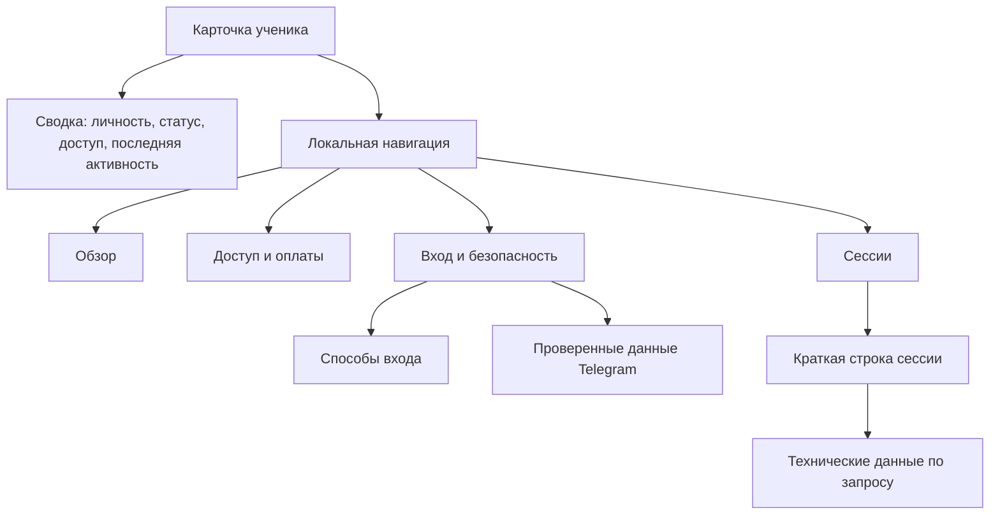

# ТЗ: карточка ученика v2

- Статус: реализовано локально, пользовательская приёмка пройдена
- Дата: 2026-07-30
- Приёмка владельцем: 2026-07-30 на `academy-dev.abrikosoff.com`
- Маршрут: `/admin/students/[userId]`
- Родительское ТЗ:
  [§ 8.3 «Карточка ученика»](../admin-panel.md#83-карточка-ученика-adminstudentsuserid)
- Область: read-only Administration

Документ уточняет информационную архитектуру и интерфейс карточки ученика.
Он не меняет доменные правила основного ТЗ и не объявляет готовыми
административные команды, которых ещё нет в коде.

## 1. Задача

Карточка должна помогать владельцу или сотруднику поддержки за 10 секунд
ответить на пять вопросов:

1. Кто этот ученик и в каком состоянии его аккаунт?
2. Есть ли у него доступ и до какого момента?
3. Какими способами он может войти?
4. Когда, откуда и с какого устройства он входил?
5. Есть ли связанные оплаты?

Техническая диагностика должна оставаться доступной, но не занимать основную
часть экрана до запроса администратора.

## 2. Основание для переработки

Текущая карточка содержит необходимые данные и корректно скрывает токены и
секреты, но воспринимается как длинный технический отчёт.

Зафиксированные проблемы текущего представления:

- на мобильном экране `390 × 844` общая высота страницы достигает примерно
  4 675 px;
- блок сессий занимает около 2 000 px;
- таблица способов входа имеет внутреннюю ширину около 880 px при доступной
  ширине около 300 px и требует неочевидной горизонтальной прокрутки;
- имя и данные Telegram повторяются в нескольких блоках;
- количество сущностей выводится без подписи: `1`, `3`;
- UUID сессии и служебные пояснения визуально конкурируют с полезной
  операторской информацией;
- часть интерактивных целей меньше рекомендуемых `44 × 44` px.

## 3. Цели и метрики результата

### 3.1. Цели

- важные данные видны без длительной прокрутки;
- экран сохраняет фирменные токены и визуальный язык Академии;
- desktop и mobile показывают одинаковый объём данных;
- технические поля раскрываются по запросу;
- интерфейс не имитирует будущие операции;
- вся информация берётся из текущей серверной read-model.

### 3.2. Проверяемые метрики

| Метрика | Требование |
|---|---|
| Горизонтальная прокрутка страницы при ширине 390 px | отсутствует |
| Доступность имени, статуса аккаунта и состояния доступа | в первом экране |
| Поиск нужного раздела | не более одного перехода по локальной навигации |
| Высота одной закрытой карточки сессии на mobile | не более 280 px |
| Минимальная интерактивная область | `44 × 44` px |
| Дублирование основной идентичности | имя и аватар не повторяются как отдельный заголовок Telegram |
| Доступ к техническим данным | не более одного раскрытия |

## 4. Границы

### 4.1. Входит в первую реализацию

- новая композиция существующей карточки;
- единая сводка ученика;
- локальная навигация по разделам;
- адаптивное представление без широких таблиц на mobile;
- компактные карточки сессий;
- раскрываемые технические данные;
- подписанные счётчики;
- копирование безопасных идентификаторов;
- состояния отсутствующих и ранее не сохранённых данных;
- автоматические тесты структуры, адаптивности и доступности.

### 4.2. Не входит в первую реализацию

- блокировка или разблокировка ученика;
- отзыв одной или всех сессий;
- изменение email для чека;
- выдача и отзыв ручного доступа;
- возвраты;
- полноценный платёжный таймлайн;
- редактирование данных Telegram;
- определение «текущей сессии» без достоверного ID текущей сессии;
- новые источники персональных или технических данных.

Эти элементы не показываются как отключённые кнопки. Они добавляются только
вместе с серверной командой, permission-проверкой, идемпотентностью, аудитом
и подтверждением из основного ТЗ.

## 5. Информационная архитектура

Порядок разделов соответствует частоте задач поддержки: сначала понять
состояние пользователя, затем проверить доступ, вход и только после этого
переходить к технической диагностике.

## 6. Композиция экрана

### 6.1. Возврат к списку

Над карточкой располагается ссылка `← Все ученики`.

Требования:

- минимальная высота интерактивной области — 44 px;
- ссылка ведёт на `/admin/students` без сброса сохранённых в URL фильтров,
  если карточка была открыта из списка;
- при прямом открытии используется `/admin/students`.

Сохранение URL списка можно реализовать безопасным параметром `returnTo`,
который допускает только внутренний путь `/admin/students?...`.

### 6.2. Единая сводка ученика

Сводка заменяет раздельные крупные заголовки `Карточка ученика`, `Профиль` и
повторяющийся заголовок Telegram.

#### Основная строка

- аватар `56 × 56` px на desktop и `48 × 48` px на mobile;
- отображаемое имя — единственный `h1` страницы;
- Telegram username, если он передан;
- бейдж состояния аккаунта: `Активен`, `Заблокирован` или `Удалён`;
- бейдж эффективного доступа: `Доступ активен`, `Запланирован`,
  `Истёк`, `Отозван` или `Доступа нет`.

Источник аватара:

1. фото последнего подтверждённого Telegram-профиля;
2. инициалы из отображаемого имени.

#### Ключевые факты

В сводке показываются:

- зарегистрирован;
- последняя известная активность или, пока фоновые обновления не готовы,
  честная подпись `Последняя сессия создана`;
- количество связанных платежей — только при наличии Billing-разрешения;
- количество способов входа.

Формат счётчиков:

- `1 платёж`, `2 платежа`, `5 платежей`;
- `1 способ входа`, `2 способа входа`;
- `1 сессия`, `2 сессии`, `5 сессий`.

#### Быстрые безопасные действия

- `Открыть Telegram` — только при наличии username;
- `Скопировать Telegram ID` — только при наличии числового ID;
- `Скопировать UUID`.

Каждая кнопка имеет видимую подпись на desktop. На mobile допускается иконка,
если у неё есть доступное имя и всплывающая/видимая подпись.

После копирования на 2 секунды показывается состояние `Скопировано`, которое
объявляется через `aria-live="polite"`.

### 6.3. Локальная навигация

Под сводкой располагаются ссылки:

1. `Обзор` → `#overview`;
2. `Доступ и оплаты` → `#access-payments`;
3. `Вход и безопасность` → `#identity-security`;
4. `Сессии` → `#sessions`.

Требования:

- переход не перезагружает страницу;
- URL получает соответствующий hash;
- заголовок раздела после перехода не скрывается под верхней панелью;
- активная ссылка имеет `aria-current="location"`;
- на mobile список прокручивается по горизонтали внутри себя, но не создаёт
  горизонтальную прокрутку всей страницы.

## 7. Разделы

### 7.1. Обзор `#overview`

В разделе остаются только сведения, не показанные в верхней сводке:

- внутренний UUID с командой копирования;
- дата и время создания в полном формате;
- email для чека — только при `users.read_payment_context`;
- количество сессий.

Краткая дата регистрации из сводки может уточняться здесь полным временем,
но не повторяется отдельной крупной карточкой. На desktop обзор допускается
как компактная строка фактов; на mobile — как список `термин — значение`.

### 7.2. Доступ и оплаты `#access-payments`

#### Сводка доступа

Первая строка содержит:

- бейдж эффективного состояния;
- ближайшую значимую дату:
  `Активен до`, `Начнётся`, `Завершился` либо `Периодов доступа нет`;
- количество источников доступа.

Пояснение об источниках сокращается до одной строки:

> Сейчас учитываются только оплаченные периоды. Ручные доступы ещё не
> подключены.

Подробное архитектурное объяснение в интерфейсе не повторяется.

#### Источники доступа

На desktop используется компактная таблица:

- источник;
- тариф;
- период;
- состояние;
- заказ — только при `billing.read_related` или `billing.read`.

На ширине до 767 px каждая запись становится карточкой. Все пять полей видны
без горизонтальной прокрутки.

UUID заказа визуально сокращается, но полное значение доступно для
копирования только администратору с Billing-разрешением. Без него колонка и
сам ID заказа отсутствуют в серверной read-model.

#### Платежи

До реализации этапа 4 показывается только достоверный счётчик связанных
платежей и только при наличии Billing-разрешения. Пустая таблица,
ссылка-заглушка или вымышленный таймлайн не добавляются.

После появления административной Billing read-model в этом разделе
добавляется компактный список последних платежей и ссылка на полный
платёжный таймлайн ученика.

### 7.3. Вход и безопасность `#identity-security`

#### Способы входа

Каждый способ показывает:

- тип;
- маскированный идентификатор;
- безопасное представление metadata;
- дату подтверждения.

На desktop допустима таблица. На ширине до 767 px каждый способ отображается
отдельной карточкой с четырьмя подписанными строками.

Если у пользователя есть Telegram и email, оба способа видны в одном разделе
и относятся к одному внутреннему UUID.

#### Проверенные данные Telegram

Основной закрытый вид одного Telegram-профиля содержит:

- `Telegram`;
- username;
- числовой Telegram ID;
- дату подтверждения;
- запрошенные scopes;
- отметку о наличии изображения профиля;
- бейдж `Проверен`.

Аватар и полное имя здесь повторно не выводятся: они уже находятся в сводке
ученика. При наличии нескольких Telegram-профилей каждый профиль получает
отдельную компактную строку.

Команды:

- открыть `https://t.me/<username>`;
- скопировать Telegram ID;
- раскрыть `Технические данные OpenID Connect`.

В раскрытом виде показываются только сохранённые безопасные поля:

- OIDC subject;
- имя;
- фамилия;
- полное имя профиля;
- username;
- время выдачи ID-токена;
- время окончания действия использованного ID-токена;
- scopes;
- результат проверки issuer, audience, nonce, подписи и срока действия.

Код авторизации, ID-токен, nonce, cookie и секрет OIDC-клиента не сохраняются
и не отображаются.

Для старых записей вместо множества строк `Не сохранено ранее` показывается
одно сообщение:

> Часть данных отсутствует: способ входа был создан до расширенного сбора
> проверенных полей и обогатится при следующем успешном входе.

Поля без значения внутри раскрытого списка не выводятся.

### 7.4. Сессии `#sessions`

#### Сортировка и объём

Порядок:

1. активные сессии;
2. затем истёкшие и отозванные;
3. внутри группы — от новой к старой по `lastSeenAt`, а при равенстве по
   `createdAt`.

По умолчанию показываются первые 5 сессий. При наличии дополнительных
сессий доступна команда `Показать ещё`. Максимум read-model остаётся 100,
что честно отмечается при усечённой выборке.

#### Закрытый вид сессии

Закрытая карточка содержит четыре смысловые группы:

1. состояние и способ входа;
2. браузер, ОС и устройство;
3. страна/регион/город и IP;
4. последняя активность, создание и истечение.

UUID сессии, Cloudflare Ray ID, архитектура и полный User-Agent в закрытом
виде не показываются.

Пример текстовой структуры:

| Группа | Пример |
|---|---|
| Состояние | `Активна · Telegram` |
| Устройство | `Chrome 150 · Android 16 · Samsung SM-S928B` |
| Сеть | `Бразилия, Joinville · IPv6 2804:…:62cb` |
| Время | `Последняя активность 30 июл., 02:17 · истекает 29 авг.` |

IP сопровождается подписью `IPv4` или `IPv6`. Длинный IPv6 сокращается только
визуально; команда копирования всегда использует полное сохранённое
значение.

#### Технические данные

По команде `Технические данные` раскрываются:

- UUID сессии с копированием;
- полные даты создания, последней активности, истечения и отзыва;
- полный IP;
- страна, регион, код региона, город и часовой пояс;
- браузер и версия;
- ОС и версия;
- тип, производитель и модель устройства;
- архитектура и разрядность;
- язык браузера;
- Cloudflare Ray ID;
- полный User-Agent.

Существующие токены сессии не отображаются.

Если сессия не содержит расширенных данных, карточка показывает одну
нейтральную подпись `Технические данные для этой сессии не сохранены или уже
удалены по сроку хранения`, а не набор повторяющихся пустых значений.

Маркер `Текущая сессия` добавляется отдельной задачей после появления
достоверного сравнения ID текущей пользовательской сессии с read-model.

## 8. Адаптивность

### 8.1. Desktop: от 961 px

- ширина содержимого использует существующий контейнер Administration;
- сводка строится в две зоны: личность и ключевые факты;
- факты располагаются в 4 компактных колонках;
- источники доступа и способы входа могут оставаться таблицами;
- закрытая сессия укладывается в одну компактную строку или сетку из
  4 колонок;
- раскрытые данные используют сетку максимум в 3 колонки.

### 8.2. Tablet: 768–960 px

- сводка и факты переходят в 2 колонки;
- локальная навигация остаётся в одну строку с внутренней прокруткой;
- закрытая сессия использует 2 колонки;
- таблицы допускаются только если все поля читаются без прокрутки страницы.

### 8.3. Mobile: до 767 px

- одна колонка;
- имя имеет размер не более 32 px;
- аватар и бейджи переносятся без наложений;
- факты показываются списком или сеткой 2 × 2;
- таблицы источников доступа и способов входа превращаются в карточки;
- UUID, IP и User-Agent переносятся или визуально сокращаются;
- технические значения не расширяют viewport;
- кнопки и `summary` имеют минимальную высоту 44 px;
- на ширине 390 px выполняется
  `document.documentElement.scrollWidth <= window.innerWidth + 1`.

## 9. Состояния

Должны быть проверены следующие комбинации:

1. активный пользователь с активным доступом;
2. активный пользователь без доступа;
3. заблокированный пользователь;
4. удалённый пользователь в read-only представлении;
5. Telegram как единственный способ входа;
6. email как единственный способ входа;
7. Telegram и email у одного UUID;
8. отсутствие способов входа;
9. отсутствие сессий;
10. IPv4 и IPv6;
11. неизвестный регион;
12. отсутствующее фото;
13. длинное имя и длинный username;
14. старая сессия без client context;
15. новая сессия со всеми техническими полями;
16. активные, истёкшие и отозванные сессии;
17. более 5 и более 100 сессий;
18. отсутствие оплаченных грантов;
19. активный, запланированный, истёкший и отозванный грант;
20. несколько Telegram-профилей.

## 10. Доступность

- на странице ровно один `h1`;
- разделы имеют последовательные `h2`;
- вложенные карточки при необходимости используют `h3`;
- состояние не передаётся только цветом;
- таблицы на desktop имеют корректные `th` и `scope`;
- mobile-карточки сохраняют явные подписи каждого значения;
- `details/summary` доступны с клавиатуры;
- у ссылок и кнопок есть видимый focus;
- кликабельные области не меньше `44 × 44` px;
- полные значения сокращённых идентификаторов доступны assistive
  technologies;
- результат копирования объявляется через `aria-live`;
- якорные переходы используют `scroll-margin-top`;
- фото имеет пустой `alt`, если рядом уже присутствует имя пользователя,
  либо содержательный `alt`, если имя рядом отсутствует.

## 11. Приватность и безопасность

- маршрут сохраняет серверные проверки `users.read` и `access.read`;
- клиентские компоненты получают только подготовленные безопасные данные;
- токены, nonce, cookie, коды авторизации и секреты не попадают в HTML,
  журналы, telemetry и clipboard;
- персональные и сетевые данные не отправляются сторонней аналитике;
- внешняя ссылка Telegram строится только из нормализованного username;
- `returnTo` принимает только локальный путь списка учеников;
- технические поля не считаются доказательством мошенничества сами по себе;
- IP и геолокация обозначаются как данные сети, а не как точное физическое
  местоположение человека.

## 12. Требования к реализации

### 12.1. Компоненты

Большая серверная страница разделяется минимум на:

- `AdminStudentSummary`;
- `AdminStudentSectionNavigation`;
- `AdminStudentAccessSection`;
- `AdminStudentIdentitySection`;
- `AdminStudentSessionList`;
- `AdminStudentSessionCard`;
- универсальное `CopyableValue`.

Названия могут быть уточнены при реализации, но ответственность компонентов
должна оставаться разделённой.

### 12.2. Данные

Первая реализация использует существующие:

- `AdminStudentDetail`;
- `AdminStudentIdentityMethod`;
- `AdminStudentTelegramProfile`;
- `AdminStudentSession`;
- `AdminStudentPaidGrant`;
- `AdminStudentEffectiveAccess`.

Допустимы чистые вычисляемые presentation-поля:

- основной Telegram-профиль;
- URL Telegram;
- последняя известная активность;
- подписанные количества;
- отсортированный список сессий;
- признаки неполной legacy-записи.

Новые сетевые вызовы из клиентских компонентов не добавляются. Серверная
страница передаёт в интерактивные компоненты только необходимые
сериализуемые значения.

### 12.3. Визуальный язык

- используются существующие цвета, шрифты, радиусы, тени и badges;
- новая палитра и новый набор компонентов не создаются;
- декоративные элементы не конкурируют со статусами;
- технический monospace применяется только к идентификаторам, IP, Ray ID и
  User-Agent;
- плотность увеличивается за счёт композиции и постепенного раскрытия
  подробностей, а не за счёт уменьшения основного текста ниже читаемого
  размера.

## 13. Автоматические проверки

### 13.1. Unit

- склонение подписанных счётчиков;
- выбор основного Telegram-профиля;
- сортировка сессий;
- формат компактной строки устройства;
- формат IPv4/IPv6;
- обнаружение legacy-сессии;
- безопасная нормализация Telegram username и `returnTo`.

### 13.2. E2E

1. администратор без `users.read` не видит карточку;
2. администратор без `access.read` не видит данные доступа;
3. сводка показывает имя, статус, доступ и последнюю известную активность;
4. локальная навигация переводит к четырём разделам;
5. Telegram ID, UUID и IP копируются полностью;
6. технические данные Telegram закрыты по умолчанию и раскрываются;
7. технические данные сессии закрыты по умолчанию и раскрываются;
8. на mobile способы входа и доступы читаются без горизонтальной прокрутки;
9. при ширине `390 × 844` страница не имеет горизонтального overflow;
10. старые сессии показывают одно сообщение о неполных данных;
11. IPv6 сокращён визуально, но clipboard получает полное значение;
12. пустые состояния способов входа, сессий и грантов корректны;
13. длинные имя, username и User-Agent не ломают layout;
14. порядок сессий соответствует разделу 7.4;
15. первые 5 сессий видны сразу, остальные раскрываются командой.

### 13.3. Ручная приёмка

Проверяются:

- Chrome desktop не уже 1440 px;
- viewport `390 × 844`;
- клавиатурная навигация без мыши;
- масштаб браузера 200%;
- IPv4 и IPv6;
- профиль с фото и без фото;
- Telegram-only и Telegram + email;
- старая и новая сессия;
- отсутствие данных и переполненные значения.

## 14. Критерии приёмки

Карточка v2 считается принятой, когда одновременно:

- верхняя сводка отвечает на вопросы «кто», «статус», «доступ» и «последняя
  активность»;
- основная идентичность ученика не дублируется отдельной крупной карточкой
  Telegram;
- все разделы доступны через локальную навигацию;
- mobile не требует горизонтальной прокрутки таблиц;
- закрытая карточка сессии показывает операторскую сводку, а технические
  поля доступны после одного раскрытия;
- идентификаторы и IP можно копировать без показа секретов;
- счётчики имеют понятные подписи;
- отсутствующие legacy-данные объясняются один раз;
- все интерактивные цели соответствуют минимальному размеру;
- `npm run check`, профильные unit/integration/E2E-тесты и
  `npm run audit:production` проходят;
- карта реализации Administration обновлена либо в описании PR явно
  указано, почему фактический статус возможностей не изменился;
- независимое ревью не содержит блокирующих замечаний;
- пользовательская приёмка пройдена на постоянном локальном HTTPS-адресе.

## 15. Рекомендуемый порядок реализации

1. Вынести presentation-функции и компонент копирования значений.
2. Собрать верхнюю сводку и локальную навигацию.
3. Перестроить доступ и способы входа для mobile.
4. Убрать дублирование Telegram-профиля и пустых legacy-полей.
5. Сжать сессии и добавить раскрываемую технику.
6. Добавить тесты состояний, адаптивности и доступности.
7. Провести самостоятельное ревью.
8. Запросить независимое ревью.
9. Передать пользователю на локальную HTTPS-приёмку.
